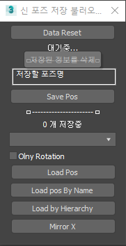

# SaveLoadSceneObjPos
포즈값 복사 및 붙혀넣기

1. 위치값을 복사할 오브젝트를 선택하고 [**Save Pos**]버튼 클릭
2. 붙혀넣을 오브젝트를 리스트에서 선택하고 [**Load ~**  ] 를 클릭
    1. 1 [**Load Pos**] = 이름과 계층 구조에 상관없이 맥스오브젝트ID로 적용 (중복된 이름이 있거나 할때 상용)
    2. 2 [**Load pos By Name**] = 선택한 본 중 같은 이름의 찾아서 적용 (중복된 이름이 없으면 무난한 방법)
   1. 3 [**Load by Herarchy**] = 이름과 상관 없이 계층구조에 따라 붙혀넣음 ( 베이스 이름이 다를때 쓰면 좋음 예 : bip01 hand 에서 bip001 hand로 적용할때)
   2. 3 [**Mirro X**] = 좌우 미러된 포즈를 잡을때 사용(오른팔을 선택하고 save 후 왼팔을 선택하고 mirro 클릭)